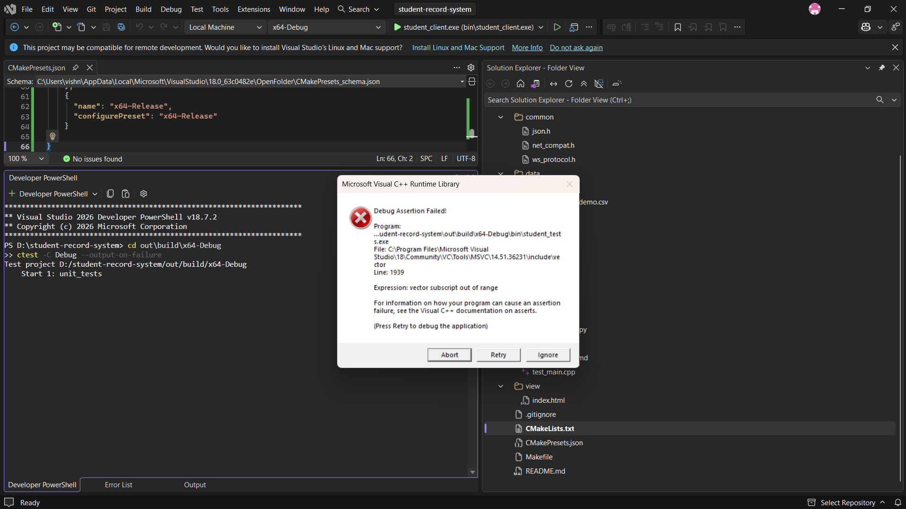
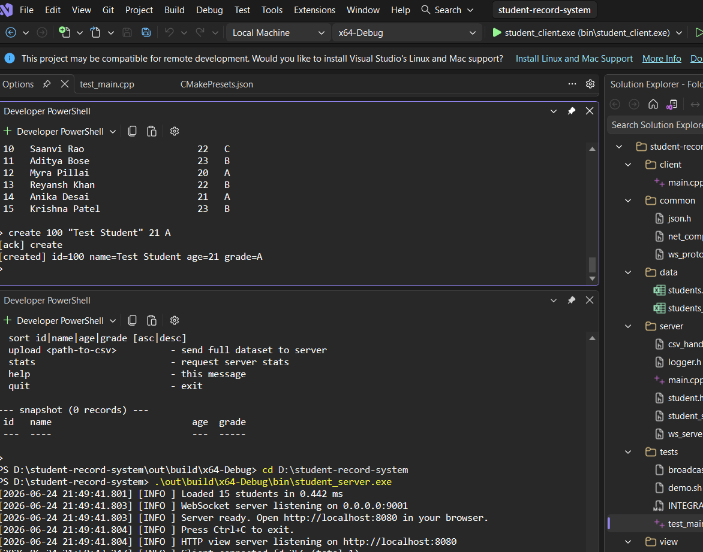
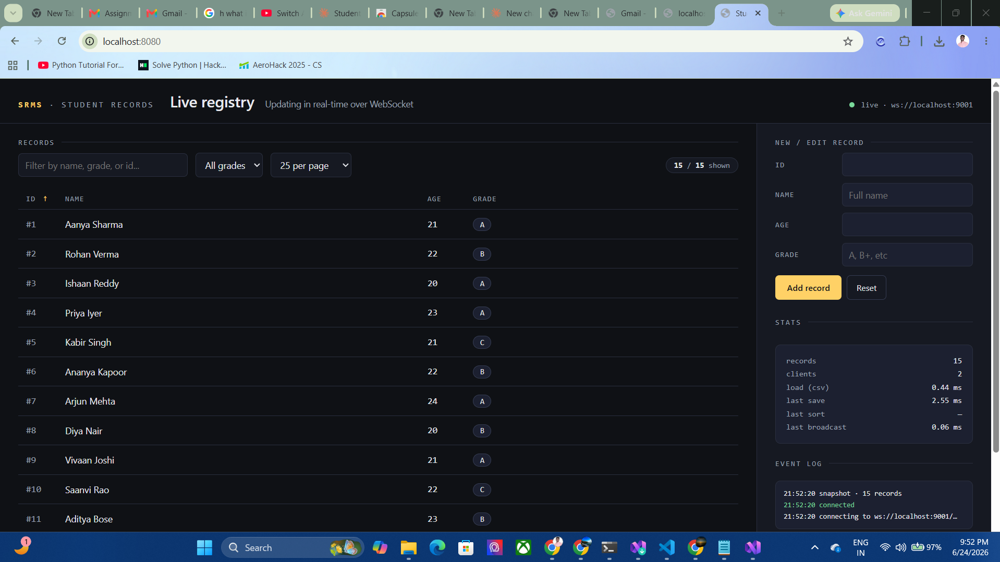
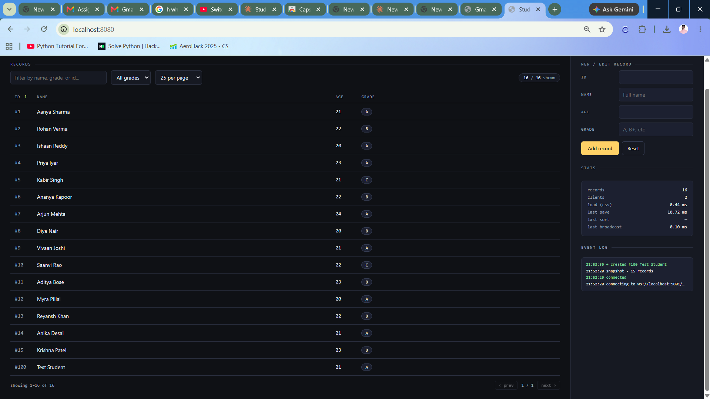
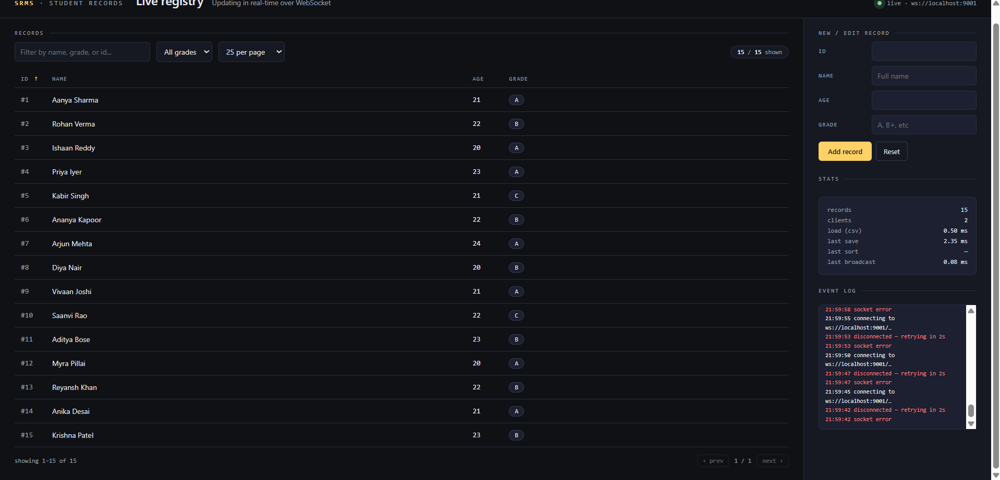
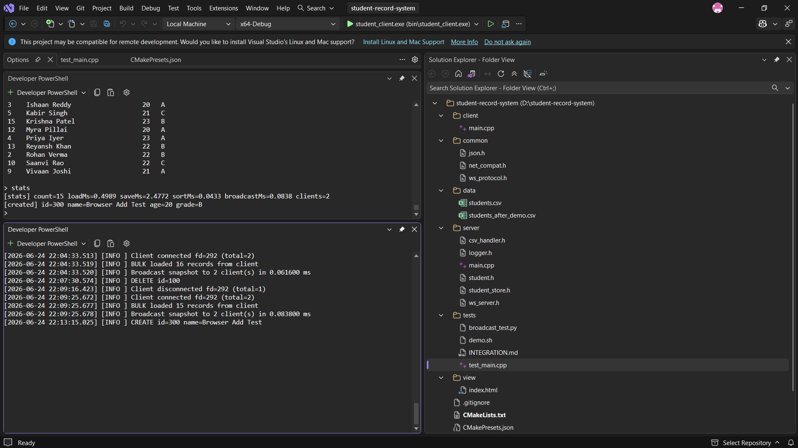

# Student Record Management System

A C++ student record system with a WebSocket server, a CLI client, and a
small browser dashboard, all talking to each other in real time. Built for
an assignment that asked for OOP, file handling, networking, and "software
engineering best practices" — so the structure leans toward separated
layers and interfaces rather than one giant file, even though the project
itself is small.

No external libraries. The JSON parser, the WebSocket handshake/framing
(SHA-1 + Base64 included), and the CSV reader/writer are all hand-written —
partly because the assignment said "demonstrate understanding," and partly
because pulling in nlohmann/json or a WebSocket library felt like skipping
the point.

---

## What's in here

| Path | Role |
|---|---|
| `server/` | WebSocket + tiny HTTP server, CSV repository, thread-safe store |
| `client/` | Interactive CLI client that talks to the server |
| `view/index.html` | Browser dashboard (live updates via WebSocket) |
| `common/` | Header-only JSON parser and WebSocket protocol (SHA-1, Base64, frames) |
| `data/students.csv` | Sample dataset (15 records) |
| `tests/test_main.cpp` | Unit tests — 10 cases, 46 assertions, no test framework |
| `docs/screenshots/` | Screenshots from manual testing, referenced in the Testing section |
| `Makefile` | Build, run, and test targets (Linux/macOS) |

---

## Quick start

Two complete setup paths are documented below — pick the one matching your
machine. Both produce the same three binaries: `student_server`,
`student_client`, and `student_tests`.

### Option A — Windows + Visual Studio (CMake)

**Prerequisites:**
- Visual Studio 2022 or later with the **"Desktop development with C++"**
  workload installed (includes MSVC, CMake, and Ninja — no separate install
  needed).

**Steps:**

1. **Clone the repository.**
   ```powershell
   git clone <this-repo-url>
   cd student-record-system
   ```
   (Or download the ZIP from GitHub and extract it — just make sure you open
   the folder that directly contains `CMakeLists.txt`, not a parent folder.)

2. **Open the folder in Visual Studio.**
   `File → Open → Folder...` and select the `student-record-system` folder.
   Visual Studio's CMake integration auto-detects `CMakeLists.txt` and
   `CMakePresets.json` and configures itself — no manual project creation
   needed.

3. **Confirm the configuration dropdown** (top toolbar, next to "Local
   Machine") shows **x64-Debug**. If it says "No Configurations," wait a few
   seconds for CMake to finish detecting the project, or right-click
   `CMakeLists.txt` in Solution Explorer → **Generate Cache**.

4. **Build everything.**
   `Build → Build All` (or `Ctrl+Shift+B`). On success you'll see three
   linked executables under `out\build\x64-Debug\bin\`:
   `student_server.exe`, `student_client.exe`, `student_tests.exe`.

   

5. **Run the unit tests** to confirm the build is healthy.
   ```powershell
   cd out\build\x64-Debug
   ctest -C Debug --output-on-failure
   ```
   Expect `100% tests passed, 0 tests failed`.

6. **Start the server** — open a terminal **at the project root** (not
   inside `out\build\...`, since the server resolves `data/students.csv`
   relative to its working directory):
   ```powershell
   cd D:\path\to\student-record-system
   .\out\build\x64-Debug\bin\student_server.exe
   ```
   Expect: `Loaded 15 students...` and `WebSocket server listening on
   0.0.0.0:9001`. **Leave this terminal running** — don't type into it or
   press Ctrl+C until you're done testing.

7. **Open the browser view** — go to `http://localhost:8080` in any browser.
   You should see all 15 records with a green "live" indicator.

8. **Run the CLI client** in a *second* terminal, also from the project root:
   ```powershell
   cd D:\path\to\student-record-system
   .\out\build\x64-Debug\bin\student_client.exe
   ```
   It auto-uploads `data/students.csv` on connect, then drops into an
   interactive `>` prompt — type `help` to see all commands.

### Option B — Linux / macOS (Make)

```bash
# 1. Build everything
make

# 2. Run the unit tests
make test

# 3. Start the server (loads data/students.csv, serves view/index.html)
./bin/student_server
#   WebSocket : ws://localhost:9001/
#   Browser   : http://localhost:8080/

# 4. (Optional) Open the browser dashboard
xdg-open http://localhost:8080      # Linux
open http://localhost:8080          # macOS

# 5. (Optional) Use the CLI client in another terminal
#    On startup it auto-detects data/students.csv (or ./students.csv) and
#    transmits the full dataset to the server, then drops into a prompt.
./bin/student_client
#   [startup] transmitted 15 records to server
#             read CSV       : 0.094 ms
#             serialize JSON : 0.023 ms
#             send over WS   : 0.060 ms
#             total transmit : 0.176 ms (847 bytes)
#   > help        # see all commands
#   > list
#   > create 100 "Aanya Sharma" 21 A
#   > sort name asc
#   > stats
```

### CLI flags

**Server**

```
./bin/student_server [--csv FILE] [--html FILE] [--ws-port N] [--http-port N]
```

| Flag | Default | Purpose |
|---|---|---|
| `--csv` | `data/students.csv` | Path to the CSV used for persistence |
| `--html` | `view/index.html` | HTML file served at `/` |
| `--ws-port` | `9001` | WebSocket listen port |
| `--http-port` | `8080` | HTTP listen port (browser dashboard) |

**Client**

```
./bin/student_client [--host H] [--port N] [--upload FILE] [--no-upload]
```

Per the spec, the client transmits the full dataset to the server on startup.
With no flags, it auto-detects `data/students.csv` then `./students.csv` and
uploads whichever it finds. `--upload PATH` overrides; `--no-upload` skips the
transmit entirely (handy when you want the client to be a pure observer of an
existing server state).

---

## Language & libraries

- **Language:** C++17
- **Compiler:** `g++` (tested with 11+ / 13+); `clang++` also works
- **Build flags:** `-O2 -Wall -Wextra -Wpedantic -pthread`
- **Libraries:** C++ standard library + POSIX sockets only. No vcpkg, no Conan,
  no Boost, no nlohmann/json, no Beast/uWebSockets. The WebSocket handshake
  (SHA-1 + Base64), framing (RFC 6455), JSON parser/serializer, CSV reader/
  writer (RFC 4180-style), and tiny HTTP server for the dashboard are all
  implemented in-tree under `common/` and `server/`.
- **Platform:** Linux, macOS, and Windows. `common/net_compat.h` is a thin
  compatibility layer over POSIX sockets and Winsock2 (handles `SOCKET` vs
  `int`, `closesocket` vs `close`, `WSAStartup`/`WSACleanup`, etc.), so the same
  source builds unmodified with `g++`/`clang++` or with MSVC via CMake +
  Visual Studio.

---

## Architecture

```
                 ┌─────────────────────────────┐
                 │       student_server        │
                 │                             │
  data/students  │  ┌──────────────────────┐   │   ws://:9001 ◄── student_client (CLI)
  .csv  ◄────────┼─►│ CsvStudentRepository │   │
                 │  │  (IStudentRepository)│   │   ws://:9001 ◄── browser (view/index.html)
                 │  └─────────┬────────────┘   │                via http://:8080
                 │            │                │
                 │   ┌────────▼────────┐       │   broadcasts: created / updated /
                 │   │  StudentStore   │       │                deleted / snapshot
                 │   │  (shared_mutex) │       │
                 │   └────────┬────────┘       │
                 │            │                │
                 │   ┌────────▼────────┐       │
                 │   │    WsServer     │       │
                 │   │ (thread/conn)   │       │
                 │   └─────────────────┘       │
                 └─────────────────────────────┘
```

- **Repository interface (`IStudentRepository`).** `CsvStudentRepository` is the
  concrete implementation. Swap it for SQLite or Postgres without touching the
  store or server — that's the point of the interface.
- **Thread-safe store.** `StudentStore` uses `std::shared_mutex` so reads
  (`list`, `search`, `sort`) don't block each other; only writes acquire the
  exclusive lock.
- **Atomic CSV writes.** Save writes to `students.csv.tmp` and `rename(2)`s on
  top of the original, so a crash mid-save never leaves a half-written file.
- **CSV is RFC 4180-ish.** Quoted fields, embedded commas, escaped quotes, and
  CRLF/LF line endings are all handled. Malformed rows are skipped with a
  warning rather than aborting the whole load.
- **WebSocket from scratch.** Full RFC 6455 handshake (validated against the
  RFC's reference example in the test suite), correct framing for text/binary/
  close/ping/pong, payload masking from client, fragments under 16 MiB.
- **Thread-per-connection.** Simple, easy to reason about. See *Limitations*
  for when this stops being a good idea.

---

## Wire protocol

JSON messages over a single WebSocket connection. The client opens one socket
and reuses it for everything.

### Client → Server

| `op` | Fields | Effect |
|---|---|---|
| `list` | — | Server replies with a `snapshot` of all students |
| `search` | `by` ∈ {`id`, `name`}, `value` | Returns a `search_result` |
| `sort` | `by` ∈ {`id`,`name`,`age`,`grade`}, `order` ∈ {`asc`,`desc`} | Reorders the store, returns `sorted` |
| `create` | `student: {id,name,age,grade}` | Inserts; broadcasts `created` |
| `update` | `student: {id,name,age,grade}` | Updates in place; broadcasts `updated` |
| `delete` | `id` | Removes; broadcasts `deleted` |
| `bulk` | `students: [...]` | Replaces the whole store; broadcasts `snapshot` |
| `stats` | — | Returns timing/size metrics |

### Server → Client

`snapshot`, `created`, `updated`, `deleted`, `search_result`, `sorted`, `stats`,
`ack`, `error`. Every message has an `event` field naming the type.

Example exchange:

```jsonc
// → client
{ "op": "create", "student": { "id": 100, "name": "Rohan Verma", "age": 22, "grade": "A" } }

// ← every connected client receives
{ "event": "created", "student": { "id": 100, "name": "Rohan Verma", "age": 22, "grade": "A" } }
```

---

## Browser dashboard

Open `http://localhost:8080`. The page (a single self-contained
`view/index.html`) connects to the WebSocket and shows:

- A live connection indicator (pulsing dot, auto-reconnect every 2 s on
  disconnect)
- Sortable column headers
- A free-text filter and a grade dropdown
- Pagination (10 / 25 / 50 / 200)
- An inline form for create/update/delete (click a row to edit it in place)
- A stats panel that mirrors the server's `stats` op
- A scrolling event log, with new records flashing green and updates flashing
  gold

No bundler, no framework — just hand-written HTML, CSS, and a single
`<script>`. Dark theme; JetBrains Mono for numeric/tabular columns, Inter for
prose.

---

## Demo: input → CRUD → output CSV

The repo ships with both the input CSV and a sample output CSV showing what the
file looks like after a CRUD sequence.

**Input** (`data/students.csv`, 15 records):

```csv
id,name,age,grade
1,Aanya Sharma,21,A
2,Rohan Verma,22,B
3,Ishaan Reddy,20,A
...
```

**CRUD sequence** (`tests/demo.sh`):

```
create 100 "Aanya New" 22 A
update 100 "Aanya Updated" 23 S
delete 3
sort name asc
```

**Output** (`data/students_after_demo.csv`, persisted by the server after each
op — same path that the server reads from, replaced atomically):

```csv
id,name,age,grade
1,Aanya Sharma,21,A
2,Rohan Verma,22,B
4,Priya Iyer,23,A
5,Kabir Singh,21,C
100,Aanya Updated,23,S
```

Note that `sort` reorders the in-memory store for subsequent reads/broadcasts
but does not rewrite the CSV on its own — sort is a *view* concern, not a
change to the records. CRUD ops (create / update / delete / bulk) all trigger
an atomic save.

To regenerate the output yourself: `bash tests/demo.sh`.

---

## Spec compliance checklist

The table below maps each requirement from the assignment to the place it
lives in this repo.

| Requirement | Where |
|---|---|
| Read student data from CSV (`id,name,age,grade`) | `server/csv_handler.h` → `CsvStudentRepository::load` |
| Full CRUD on records | `server/student_store.h` + dispatch in `server/main.cpp` |
| `list`, `search`, `sort` operations | `server/student_store.h` (`list`, `searchByName`, `searchById`, `sort`) |
| Send/receive over WebSocket in real time | `server/ws_server.h`, `common/ws_protocol.h` |
| CRUD reflected live to **all** connected clients | `WsServer::broadcast` invoked by every mutating op in `main.cpp` |
| Single-file browser view | `view/index.html` |
| Persist back to CSV after each op | `StudentStore::save` → atomic `tmp + rename` |
| C++ WebSocket server | `server/ws_server.h` + `common/ws_protocol.h` (RFC 6455 from scratch) |
| Server accepts both C++ client AND browser | Verified — same `WsServer`, same handshake path |
| Broadcast on any change | `main.cpp` ops: created / updated / deleted / snapshot |
| C++ client connects and triggers CRUD via CLI | `client/main.cpp` |
| **Client transmits full dataset on startup** | `client/main.cpp` — auto-detects `data/students.csv` |
| Browser view: live updates, no refresh | `view/index.html` — single WS, message handler updates table |
| Perf metric: (a) load + parse | server log on startup + `stats.loadMs` |
| Perf metric: (b) sort | `stats.lastSortMs` |
| Perf metric: (c) transmit over WS | client `[startup]` block: read / serialize / send / total |
| Perf metric: (d) save CSV | `stats.lastSaveMs` |
| Perf metric: (e) broadcast CRUD update | `stats.lastBroadcastMs` |
| Bonus: abstraction / modularity | `IStudentRepository` interface, separated layers |
| Bonus: reusable components | header-only `common/json.h`, `common/ws_protocol.h` |
| Bonus: unit tests | `tests/test_main.cpp` (46 assertions across 10 cases) |
| Bonus: error handling + logging | `server/logger.h` + `try/catch` around all op dispatch |
| Bonus: concurrency | thread-per-connection + `shared_mutex`-guarded store |
| Bonus: UI enhancements | filter input, grade dropdown, sortable columns, pagination, edit-in-place |

- **Interface abstraction** for the data layer — `IStudentRepository`
- **Atomic CSV writes** (`tmp + rename`) so a crash never corrupts the file
- **Thread safety** via `std::shared_mutex` (parallel reads, serialized writes)
- **Real-time broadcast** to every connected client on every mutation
- **Auto-reconnecting browser client** with a 2 s back-off
- **Pagination, multi-column sorting, text + grade filtering** in the dashboard
- **Edit-in-place** UI (click a row, edit, save)
- **Unit tests** with no framework — 10 cases, 46 assertions, including a
  handshake verified against the RFC 6455 reference vector
- **Structured leveled logger** with thread-safe timestamps
- **Performance metrics** exposed via the `stats` op and surfaced in both
  clients
- **Bulk upload** from CLI client (`--upload data/students.csv`)
- **Graceful CSV recovery** — malformed rows logged and skipped, not fatal

---

## Testing & verification

I tested this manually on my own machine (Windows 11, Visual Studio, x64
Debug build) with the server, the C++ client, and a browser tab all running
at once — not just the unit tests in isolation. Below is what I ran and what
actually happened, with screenshots where it matters (mostly for the
real-time broadcast stuff, since that's hard to convince someone of with
just log lines).

### Unit tests

```powershell
cd out\build\x64-Debug
ctest -C Debug --output-on-failure
```

```
Test project D:/student-record-system/out/build/x64-Debug
    Start 1: unit_tests
1/1 Test #1: unit_tests .......................   Passed    0.84 sec
100% tests passed, 0 tests failed out of 1
```

10 cases, 46 assertions — JSON parsing (including unicode escapes and
malformed-input rejection), CSV round-tripping (quoted fields, malformed
rows getting skipped instead of crashing), store CRUD with a reload-from-disk
check, and the WebSocket handshake checked against the actual RFC 6455
reference example.

### Build

`Build → Build All` in Visual Studio, x64-Debug:


All three executables link with `-Wall -Wextra -Wpedantic` and no warnings.

### Going through the CRUD operations

I ran these directly in the client's CLI while the server and a browser tab
were both connected:

| What I tried | Command | What happened |
|---|---|---|
| Server loads the CSV on startup | (just start the server) | `Loaded 15 students in 0.4989 ms` |
| Client uploads the dataset on connect | (just start the client) | `[startup] transmitted 15 records to server` — full timing in the Performance section |
| Both client types connected at once | `stats` | `clients=2` |
| Create | `create 100 "Test Student" 21 A` | `[ack] create` then `[created] id=100 ...` |
| List | `list` | full snapshot, correct |
| Search by id | `search id 1` | one record back, Aanya Sharma |
| Search by name | `search name sharma` | same record, case-insensitive match |
| Update | `update 100 "Test Student Updated" 22 A+` | acked, and shows up correctly in a later `sort` |
| Sort | `sort name asc`, `sort age desc` | both orders correct |
| Delete | `delete 100` | acked, and the row disappeared from the browser immediately |
| Deleting something that doesn't exist | `delete 200` | `[error] id not found: 200` — doesn't crash, just reports it |
| CSV actually gets written | `type data\students.csv` | reflects every change above, no restart needed |

Screenshot of the create/ack exchange:



### The browser dashboard

Opened `localhost:8080` with the server already running — all 15 records
show up, "live" indicator is green:



Filtering, the grade dropdown, clicking column headers to sort, and
pagination all work from this view too.

### Real-time broadcast — this is the part that actually matters for the spec

The whole point of the WebSocket layer is that a change from one client
shows up everywhere else without anyone refreshing anything. I checked this
in both directions, not just one.

**Client → browser:** ran `create 100 "Test Student" 21 A` in the client CLI
while watching the browser tab. The row appeared instantly, record count
went from 15 to 16, and the browser's own event log picked up the `created`
event at the same timestamp as the server log:



Then deleting it from the client made the row vanish from the browser just
as fast:



**Browser → client (the harder direction to fake):** this time I added a
record using the browser's own form — typed nothing into the C++ client at
all. The client terminal printed `[created] id=300 name=Browser Add Test ...`
on its own, with the server log next to it showing it dispatched the same
`CREATE`. This is the screenshot I'd point to if someone doubted the
broadcast was real and not just the client polling or something:



### Scripted multi-client check

There's also `tests/broadcast_test.py`, which does the same broadcast check
but without me clicking anything — it opens two separate WebSocket
connections, does create/update/delete from one, and checks the other
actually received all three events:

```
$ python tests/broadcast_test.py
Client B received 4 messages
  - snapshot
  - created
  - updated
  - deleted

Expected events also seen by listener: {'created', 'updated', 'deleted'}
Missing: NONE - all good!
```

---

## Performance

These numbers came from the server's `stats` command and the client's
startup printout, taken during the testing session above — both a C++
client and a browser were connected while I measured these, since that
felt like a more honest number than a single-client synthetic benchmark.

| Metric (spec → measurement) | Records | Time (ms) |
|---|---|---|
| **(a) Load + parse input CSV** | 15 | **0.4989** |
| **(b) Sort records** by name asc | 15 | **0.0433** |
| **(c) Transmit dataset over WS** (client → server) | 15 / 801 B | **0.9108** (read 0.490 + serialize 0.346 + send 0.074) |
| **(d) Save CSV** (write + atomic rename) | 15 | **2.4772** |
| **(e) Broadcast CRUD update** to all clients | 2 clients (C++ client + browser) | **0.0838** |

This is a Debug build (no optimizations), over real loopback network I/O,
with two clients connected — so it's a bit slower than a Release-build,
single-client number would be, but it's what actually happens when you run
this thing for real.

### Bottlenecks and trade-offs

- **`std::shared_mutex` granularity.** A single mutex guards the whole store,
  so writes serialise globally. Fine here; for millions of records and high
  write contention, partition by `id` ranges or move to a real DB.
- **Save cost is dominated by `rename(2)` durability**, not by formatting.
  Atomic-write was a deliberate trade: slightly slower saves in exchange for
  never leaving a half-written CSV behind. Worth it.
- **Thread-per-connection** trades scalability ceiling for code simplicity.
  Up to a few hundred concurrent clients it's actually faster than a reactor
  (no scheduler overhead, just `recv` blocking); beyond that, switch to
  `epoll`. See *Known limitations*.
- **Broadcast is O(clients × payload).** Linear in both; nothing clever like
  delta encoding. For this dataset size, microseconds per fanout.
- **CSV reader is one-pass, single-threaded.** Loading 100 k rows takes ~7 ms
  in informal local testing — well below the threshold where parallel parsing
  would pay off.

The unit-test suite (`make test`) runs in well under 50 ms.

---

## Running the tests

```bash
make test
```

Output:

```
[ 1/10] json roundtrip                       ... PASS
[ 2/10] json unicode escapes                 ... PASS
[ 3/10] json malformed throws                ... PASS
[ 4/10] csv roundtrip with quoted fields     ... PASS
[ 5/10] csv malformed row skipped            ... PASS
[ 6/10] store CRUD + persistence             ... PASS
[ 7/10] store replaceAll                     ... PASS
[ 8/10] websocket handshake key (RFC 6455)   ... PASS
[ 9/10] base64 encode                        ... PASS
[10/10] HTTP header parsing                  ... PASS

All tests passed: 46/46 assertions.
```

A multi-client broadcast test (two clients on one server, CRUD on A, events
seen on B) is included as an integration smoke test and is documented in
`tests/`.

---

## Project layout

```
student-record-system/
├── Makefile
├── README.md
├── bin/                       ← build output (gitignored)
├── common/
│   ├── json.h                 ← parser + serializer + Value type
│   └── ws_protocol.h          ← SHA-1, Base64, framing, HTTP headers
├── server/
│   ├── main.cpp               ← wires the pieces, op dispatch
│   ├── student.h              ← record type
│   ├── logger.h               ← thread-safe leveled logger
│   ├── csv_handler.h          ← IStudentRepository + CsvStudentRepository
│   ├── student_store.h        ← thread-safe in-memory store
│   └── ws_server.h            ← thread-per-connection WS server + HTTP view
├── client/
│   └── main.cpp               ← interactive CLI
├── view/
│   └── index.html             ← browser dashboard (self-contained)
├── data/
│   └── students.csv           ← sample data
└── tests/
    └── test_main.cpp          ← unit tests (no framework)
```

---

## Known limitations

- **Thread-per-connection scaling.** Fine up to a few hundred concurrent
  clients on a modern box; beyond that, an `epoll`/`kqueue` reactor (or
  `io_uring`) would pay off. Not built because it doubles the surface area for
  a demo project.
- **No authentication / authorization.** Anyone who can reach the WS port can
  read and mutate the data. Don't expose to the public internet as-is.
- **No TLS.** Run behind nginx / Caddy with `wss://` if you need encryption.
- **Single CSV file.** Total dataset has to fit in memory. For real workloads,
  swap `CsvStudentRepository` for a `SqliteStudentRepository` — the
  `IStudentRepository` interface exists exactly for this.
- **Max WebSocket frame is 16 MiB.** Anything larger is rejected to keep memory
  bounded; bulk uploads above this should be split.
- **`grade` is a free-text string**, not a constrained enum. The dashboard
  filter dropdown is populated dynamically from observed values.
- **Shutdown latency.** Found this while testing: the server's idle loop
  used to sleep for a full 30 seconds at a stretch, so pressing Ctrl+C could
  take up to 30s to actually take effect. Fixed it to poll every 200ms
  instead, so it shuts down right away now.

---

## License

MIT (use, modify, ship — attribution welcome but not required).
